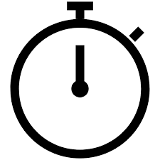
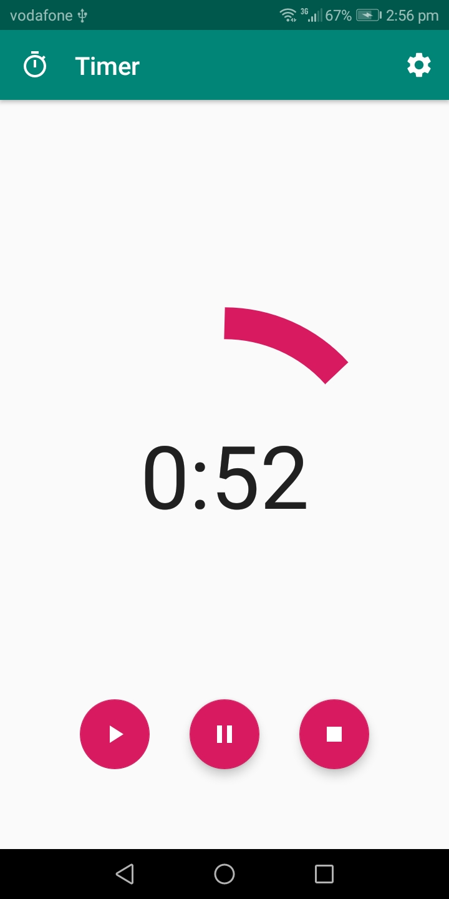
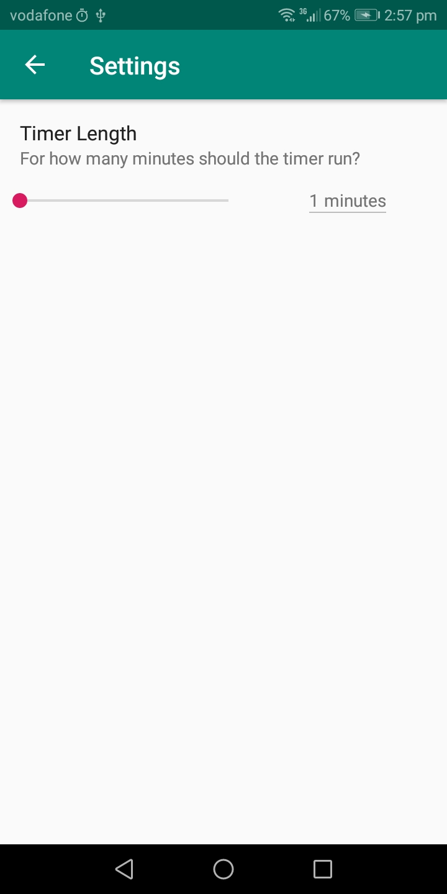
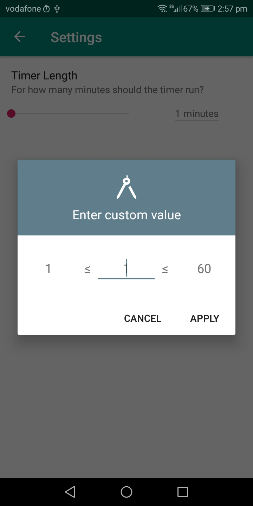
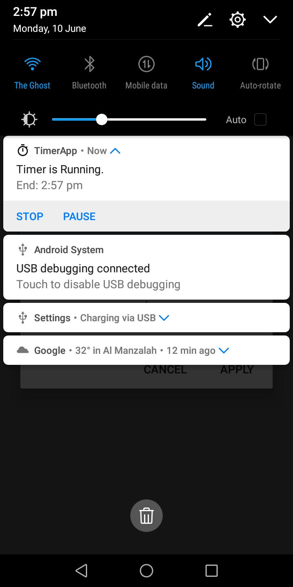

# TimerApp
</a>

- This app is a self improvment app
- It's a simple timer runs foreground and background
- This app is written in kotlin.

# Liberaries used

- [Kotlin programing language](#kotlin-stdlib-jdk7:1.3.31)
- [Material Progressbar](#materialprogressbar:library:1.6.1)
- [Material Seekbar Preference](#material-seekbar-preference:2.3.0)

# Screenshots

## Reach out to me at one of the following places!

- Mail me at <a href="emish52020@gmail" target="_blank">`Emish52020@gmail`</a>

